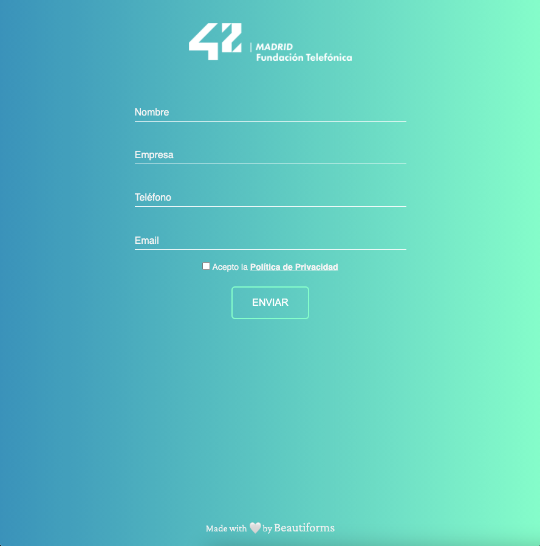
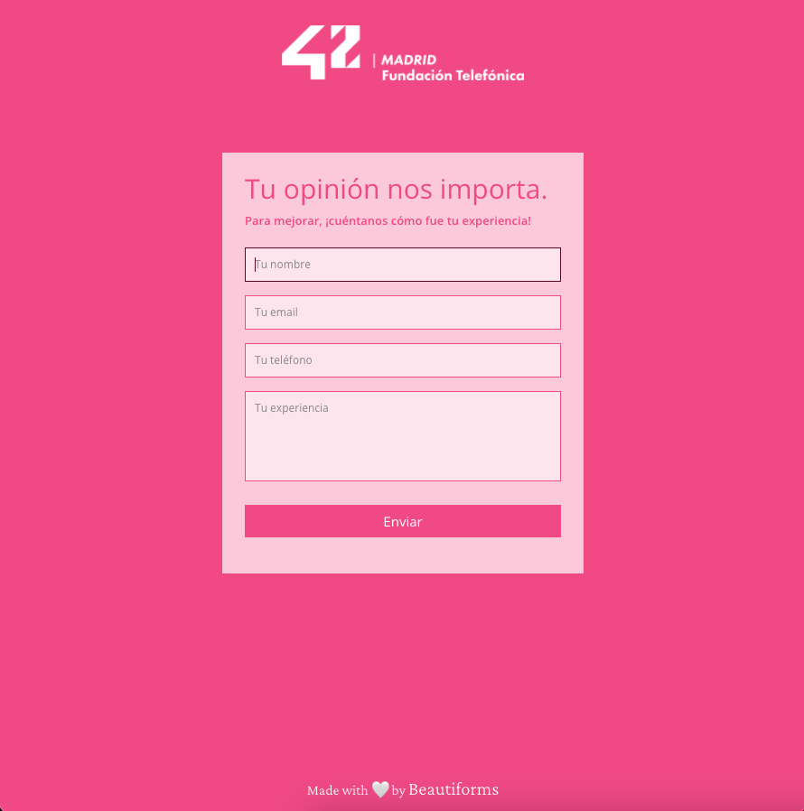

  

<h1 align="center">
  Welcome to Beautiforms! 👋
</h1>

¡Hola!

Si has llegado hasta aquí para encontrar algunos estilos de formularios agradables y mucho más atractivos para tu vista que los que HTML5 nos ofrece por defecto, has llegado al lugar indicado.

Quizá el juego de palabras de Beautiful + Forms es un poco overpromise. Desde ya, si los formularios que hay hasta ahora no son lo suficientemente maravillosos, te pido disculpas, pero te prometo que habrá cada vez más **Beautiforms**, hasta que alguno te guste de verdad. 🤞

Siéntete libre de usar, modificar, adaptar, trocear e innovar en cada uno de las plantillas de formularios que hay.

Son muy sencillos, utilizan únicamente HTML5 y CSS3, y están realizado de diferentes formas para que veas que hay muchísimas formas de hacer las cosas en programación. La que más se acomode a tu nivel o necesidad, será la ideal para ti en este momento.

De momento, existen solo los siguientes **Beautiforms**:
- Hyperloop

Haciéndole honor al proyecto [Hyperloop](https://virginhyperloop.com/), mostrando su rapidez y aerodinámica, verás un bonito efecto al seleccionar cada campo del formulario.

  

- Let Me Know

Este ejemplo es más sencillo, sin tantos efectos, pero muy interesante para obtener opiniones de usuarios. Se pueden combinar colores que se adaptarán a cualquier estilo de página web, sea para la marca que sea.

  

                                                   
Pronto habrán muchos más. Espero que te sirvan y que te ayuden a comprender más algunas propiedades de CSS3 y algunas tags interesantes de HTML5.

Y, por supuesto, si tienes dudas o sugerencias, no dudes en escribirme.

Happy coding! 👩‍💻
